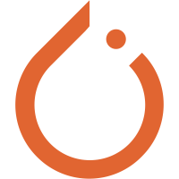

</a>

**
📢纵有疾风起，人生不言弃 | Le vent se lève, il faut tenter de vivre🏃
**

### 👋 关于我 | Player

- 🌏️某不知名大专大数据专业研一在读生一枚
- ⌨ 编程水货 🔜🧙图形学/视觉炼丹侠
- 💬 建立羁绊：1422257646@qq.com
- ⭐ 个人博客：🈺[coolchong.cn](https://coolchong.cn)
- 😋 杂食动物：🥤肥宅快乐水&&🎮️菜还爱玩&&🎸能谈响就行

### ⚒️ 技能树 | Stack

| 可能会的                                                     | 一知半解                                                     | 不懂装懂                                                     |
| ------------------------------------------------------------ | ------------------------------------------------------------ | ------------------------------------------------------------ |
| <code></code> <code></code> <code></code> <code></code> <code></code> | <code></code> <code></code> <code></code> | <code></code><code></code><code></code> |

### 🧰 工具箱 | Tool

<code></code>
<code></code>
<code></code>
<code></code>
<code></code>
<code></code>
<code></code>
<code></code>

### 🏆 数据板 | Record

